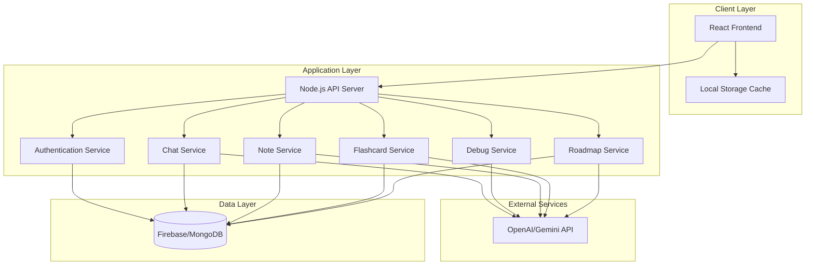
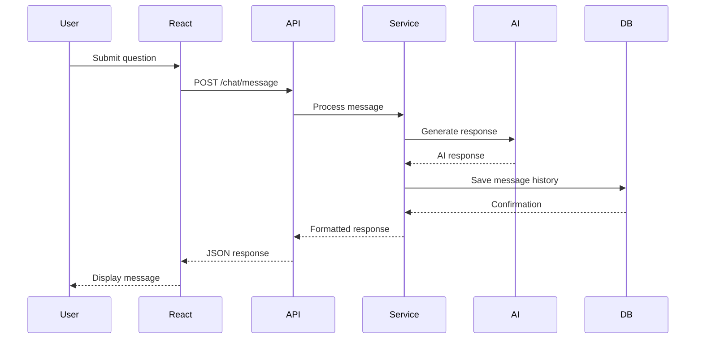

# Design Document: AI Mentor

## Overview

The AI Mentor is a full-stack web application that provides AI-powered learning assistance through a chat interface. The system consists of a React frontend for user interaction, a Node.js backend for business logic and API orchestration, a database (Firebase/MongoDB) for data persistence, and integration with AI services (OpenAI/Gemini) for natural language processing.

The architecture follows a three-tier pattern: presentation layer (React), application layer (Node.js), and data layer (Firebase/MongoDB). The system is designed to be scalable, maintainable, and extensible for future features like voice assistance and offline mode.

## Architecture

### High-Level Architecture



### Component Interaction Flow



## Components and Interfaces

### Frontend Components (React)

#### ChatInterface Component
- Manages the main chat conversation UI
- Displays message history with user/AI distinction
- Handles message input and submission
- Shows typing indicators during AI processing
- Renders markdown content including code blocks

**Props:**
```typescript
interface ChatInterfaceProps {
  userId: string;
  sessionId: string;
  onMessageSent: (message: string) => void;
}
```

**State:**
```typescript
interface ChatState {
  messages: Message[];
  isLoading: boolean;
  inputText: string;
  error: string | null;
}
```

#### NotesPanel Component
- Displays user's saved notes
- Allows editing and organizing notes
- Supports filtering by date and topic
- Provides export functionality

#### FlashcardsPanel Component
- Shows flashcard deck interface
- Implements flip animation for practice mode
- Tracks review progress
- Allows editing individual flashcards

#### RoadmapView Component
- Visualizes learning roadmap as timeline
- Shows milestone completion status
- Allows marking milestones as complete
- Displays recommended resources per phase

#### AuthenticationForm Component
- Handles user registration and login
- Validates input fields
- Manages authentication state
- Displays error messages

### Backend Services (Node.js)

#### ChatService
Handles conversational AI interactions and message management.

**Interface:**
```typescript
interface ChatService {
  sendMessage(userId: string, sessionId: string, message: string): Promise<ChatResponse>;
  getHistory(userId: string, sessionId: string): Promise<Message[]>;
  createSession(userId: string): Promise<string>;
}

interface ChatResponse {
  messageId: string;
  content: string;
  timestamp: Date;
  tokensUsed: number;
}

interface Message {
  id: string;
  userId: string;
  sessionId: string;
  role: 'user' | 'assistant';
  content: string;
  timestamp: Date;
}
```

**Responsibilities:**
- Format prompts for AI API
- Maintain conversation context
- Handle AI API errors and retries
- Save message history to database
- Implement response caching

#### DebugService
Analyzes code and provides debugging assistance.

**Interface:**
```typescript
interface DebugService {
  analyzeCode(code: string, language: string, errorDescription: string): Promise<DebugResponse>;
  detectLanguage(code: string): Promise<string>;
}

interface DebugResponse {
  issues: CodeIssue[];
  suggestions: string[];
  correctedCode: string;
  explanation: string;
}

interface CodeIssue {
  line: number;
  severity: 'error' | 'warning' | 'info';
  message: string;
  type: string;
}
```

**Responsibilities:**
- Detect programming language from code
- Format code analysis prompts for AI
- Parse AI responses into structured issues
- Generate corrected code with comments
- Support multiple programming languages

#### NoteService
Generates and manages structured notes from learning sessions.

**Interface:**
```typescript
interface NoteService {
  generateNotes(sessionId: string, userId: string): Promise<Note>;
  saveNote(note: Note): Promise<string>;
  getNotes(userId: string, filters?: NoteFilters): Promise<Note[]>;
  updateNote(noteId: string, content: string): Promise<void>;
  deleteNote(noteId: string): Promise<void>;
}

interface Note {
  id: string;
  userId: string;
  sessionId: string;
  title: string;
  content: string;
  topics: string[];
  createdAt: Date;
  updatedAt: Date;
}

interface NoteFilters {
  startDate?: Date;
  endDate?: Date;
  topics?: string[];
}
```

**Responsibilities:**
- Extract key concepts from chat history
- Generate structured markdown notes
- Organize content with headings and examples
- Persist notes to database
- Support CRUD operations on notes

#### FlashcardService
Creates and manages flashcards for spaced repetition learning.

**Interface:**
```typescript
interface FlashcardService {
  generateFlashcards(sessionId: string, userId: string, count: number): Promise<Flashcard[]>;
  saveFlashcards(flashcards: Flashcard[]): Promise<string[]>;
  getFlashcards(userId: string, filters?: FlashcardFilters): Promise<Flashcard[]>;
  updateFlashcard(flashcardId: string, updates: Partial<Flashcard>): Promise<void>;
  markReviewed(flashcardId: string, userId: string): Promise<void>;
}

interface Flashcard {
  id: string;
  userId: string;
  sessionId: string;
  question: string;
  answer: string;
  topic: string;
  difficulty: 'easy' | 'medium' | 'hard';
  lastReviewed?: Date;
  reviewCount: number;
  createdAt: Date;
}

interface FlashcardFilters {
  topics?: string[];
  difficulty?: string;
  unreviewed?: boolean;
}
```

**Responsibilities:**
- Generate question-answer pairs from content
- Determine appropriate difficulty levels
- Track review history
- Support filtering and search
- Implement spaced repetition logic

#### RoadmapService
Creates personalized learning roadmaps based on user goals.

**Interface:**
```typescript
interface RoadmapService {
  generateRoadmap(userId: string, goal: string, currentLevel: string): Promise<Roadmap>;
  saveRoadmap(roadmap: Roadmap): Promise<string>;
  getRoadmap(userId: string): Promise<Roadmap | null>;
  updateMilestone(roadmapId: string, milestoneId: string, completed: boolean): Promise<void>;
}

interface Roadmap {
  id: string;
  userId: string;
  goal: string;
  currentLevel: string;
  phases: Phase[];
  createdAt: Date;
  updatedAt: Date;
}

interface Phase {
  id: string;
  title: string;
  description: string;
  estimatedWeeks: number;
  milestones: Milestone[];
  resources: Resource[];
}

interface Milestone {
  id: string;
  title: string;
  description: string;
  completed: boolean;
  completedAt?: Date;
}

interface Resource {
  title: string;
  type: 'article' | 'video' | 'course' | 'book';
  url?: string;
}
```

**Responsibilities:**
- Generate structured learning paths
- Organize content into phases and milestones
- Recommend relevant resources
- Track progress and completion
- Adapt roadmap based on user progress

#### AuthenticationService
Manages user authentication and session management.

**Interface:**
```typescript
interface AuthenticationService {
  register(email: string, password: string): Promise<AuthResult>;
  login(email: string, password: string): Promise<AuthResult>;
  logout(userId: string): Promise<void>;
  validateSession(token: string): Promise<User>;
  refreshToken(refreshToken: string): Promise<string>;
}

interface AuthResult {
  user: User;
  accessToken: string;
  refreshToken: string;
}

interface User {
  id: string;
  email: string;
  createdAt: Date;
  lastLogin: Date;
}
```

**Responsibilities:**
- Hash and validate passwords
- Generate JWT tokens
- Validate session tokens
- Manage token refresh
- Handle logout and session cleanup

### AI Integration Layer

#### AIProvider Interface
Abstraction layer for AI service integration, allowing switching between OpenAI and Gemini.

**Interface:**
```typescript
interface AIProvider {
  generateResponse(prompt: string, context?: Message[]): Promise<AIResponse>;
  analyzeCode(code: string, task: string): Promise<string>;
  generateStructuredContent(prompt: string, format: ContentFormat): Promise<string>;
}

interface AIResponse {
  content: string;
  tokensUsed: number;
  model: string;
}

type ContentFormat = 'notes' | 'flashcards' | 'roadmap';
```

**Implementations:**
- OpenAIProvider: Uses OpenAI GPT models
- GeminiProvider: Uses Google Gemini models

**Responsibilities:**
- Abstract AI API differences
- Handle rate limiting and retries
- Format prompts appropriately
- Parse and validate responses
- Track token usage

## Data Models

### Database Schema

#### Users Collection
```typescript
{
  id: string;              // Primary key
  email: string;           // Unique, indexed
  passwordHash: string;
  createdAt: Date;
  lastLogin: Date;
  preferences: {
    theme: 'light' | 'dark';
    aiModel: 'openai' | 'gemini';
  };
}
```

#### ChatSessions Collection
```typescript
{
  id: string;              // Primary key
  userId: string;          // Foreign key, indexed
  title: string;
  createdAt: Date;
  lastMessageAt: Date;
  messageCount: number;
}
```

#### Messages Collection
```typescript
{
  id: string;              // Primary key
  sessionId: string;       // Foreign key, indexed
  userId: string;          // Foreign key, indexed
  role: 'user' | 'assistant';
  content: string;
  timestamp: Date;
  tokensUsed?: number;
}
```

#### Notes Collection
```typescript
{
  id: string;              // Primary key
  userId: string;          // Foreign key, indexed
  sessionId: string;       // Foreign key
  title: string;
  content: string;         // Markdown format
  topics: string[];        // Indexed for search
  createdAt: Date;
  updatedAt: Date;
}
```

#### Flashcards Collection
```typescript
{
  id: string;              // Primary key
  userId: string;          // Foreign key, indexed
  sessionId: string;       // Foreign key
  question: string;
  answer: string;
  topic: string;           // Indexed
  difficulty: 'easy' | 'medium' | 'hard';
  lastReviewed?: Date;
  reviewCount: number;
  createdAt: Date;
}
```

#### Roadmaps Collection
```typescript
{
  id: string;              // Primary key
  userId: string;          // Foreign key, indexed, unique
  goal: string;
  currentLevel: string;
  phases: Phase[];         // Embedded documents
  createdAt: Date;
  updatedAt: Date;
}
```

### API Endpoints

#### Authentication Endpoints
- `POST /auth/register` - Register new user
- `POST /auth/login` - Authenticate user
- `POST /auth/logout` - End user session
- `POST /auth/refresh` - Refresh access token

#### Chat Endpoints
- `POST /chat/sessions` - Create new chat session
- `GET /chat/sessions/:userId` - Get user's chat sessions
- `POST /chat/message` - Send message and get AI response
- `GET /chat/history/:sessionId` - Get session message history

#### Debug Endpoints
- `POST /debug/analyze` - Analyze code and get debugging help
- `POST /debug/detect-language` - Detect programming language

#### Notes Endpoints
- `POST /notes/generate` - Generate notes from session
- `GET /notes/:userId` - Get user's notes
- `PUT /notes/:noteId` - Update note content
- `DELETE /notes/:noteId` - Delete note

#### Flashcards Endpoints
- `POST /flashcards/generate` - Generate flashcards from session
- `GET /flashcards/:userId` - Get user's flashcards
- `PUT /flashcards/:flashcardId` - Update flashcard
- `POST /flashcards/:flashcardId/review` - Mark flashcard as reviewed

#### Roadmap Endpoints
- `POST /roadmaps/generate` - Generate learning roadmap
- `GET /roadmaps/:userId` - Get user's roadmap
- `PUT /roadmaps/:roadmapId/milestone/:milestoneId` - Update milestone status


## Correctness Properties

A property is a characteristic or behavior that should hold true across all valid executions of a system—essentially, a formal statement about what the system should do. Properties serve as the bridge between human-readable specifications and machine-verifiable correctness guarantees.

### Property 1: Conversation Context Preservation

*For any* chat session with multiple messages, when a user sends a follow-up message referencing previous context, the AI response should demonstrate awareness of earlier messages in the conversation.

**Validates: Requirements 1.2**

### Property 2: Language Detection Accuracy

*For any* valid code snippet in Python, JavaScript, Java, or C++, the language detection function should correctly identify the programming language without requiring explicit specification.

**Validates: Requirements 2.3**

### Property 3: Debug Response Completeness

*For any* debugging request, the response should contain both corrected code and explanatory comments describing the fixes.

**Validates: Requirements 2.5**

### Property 4: Markdown Rendering in Responses

*For any* AI response containing code, lists, or formatted text, the rendered output should properly display markdown elements including code blocks, bullet points, and emphasis.

**Validates: Requirements 1.3, 7.3, 8.3**

### Property 5: Notes Format Structure

*For any* generated note, the content should contain at least one markdown heading, and may contain bullet points or code blocks when appropriate to the content.

**Validates: Requirements 3.2**

### Property 6: Content Editing Capability

*For any* generated content (notes or flashcards), the system should provide an interface allowing users to modify the content, and modifications should be persisted.

**Validates: Requirements 3.3, 4.3**

### Property 7: Data Persistence Round-Trip

*For any* user-created data (notes, flashcards, chat messages, roadmaps), saving the data and then retrieving it should return equivalent content associated with the correct user account.

**Validates: Requirements 3.4, 4.4, 5.3**

### Property 8: Notes Organization and Retrieval

*For any* set of notes with different dates and topics, retrieving all notes should return them organized by date and topic as specified in the query filters.

**Validates: Requirements 3.5**

### Property 9: Minimum Flashcard Generation

*For any* learning session with sufficient content, generating flashcards should produce at least 5 flashcard question-answer pairs.

**Validates: Requirements 4.2**

### Property 10: Flashcard Review Tracking

*For any* flashcard marked as reviewed, the system should update the lastReviewed timestamp and increment the reviewCount.

**Validates: Requirements 4.5**

### Property 11: User Registration and Account Creation

*For any* valid email and password combination, the registration process should create a new user account that can be subsequently authenticated.

**Validates: Requirements 5.1**

### Property 12: Authentication Success and Failure

*For any* registered user, authentication should succeed with correct credentials and fail with incorrect credentials, returning appropriate success or error responses.

**Validates: Requirements 5.2**

### Property 13: Cross-Device Data Access

*For any* user account, logging in from different sessions should provide access to the same complete set of chat history, notes, flashcards, and roadmaps.

**Validates: Requirements 5.4**

### Property 14: Session Cleanup on Logout

*For any* authenticated session, after logout, the session token should be invalid and sensitive data should be cleared from client storage.

**Validates: Requirements 5.5**

### Property 15: Roadmap Structure Completeness

*For any* generated roadmap, it should contain phases with milestones, estimated timeframes, and recommended resources for each phase.

**Validates: Requirements 6.1, 6.2, 6.3**

### Property 16: Milestone Completion and Progress Tracking

*For any* roadmap milestone, marking it as complete should update its completion status and timestamp, and the roadmap should reflect updated progress.

**Validates: Requirements 6.4, 6.5**

### Property 17: Loading State Indicators

*For any* asynchronous operation (message sending, data loading), the UI should display a loading indicator while the operation is in progress.

**Validates: Requirements 8.2, 8.5**

### Property 18: Network Error Retry Logic

*For any* AI API request that fails due to network error, the system should retry up to 3 times before displaying an error message to the user.

**Validates: Requirements 9.1**

### Property 19: Offline Data Caching

*For any* user data operation when the database is unavailable, the system should cache the data locally and sync it when the connection is restored.

**Validates: Requirements 9.2**

### Property 20: Input Validation Error Messages

*For any* invalid user input (empty fields, malformed data), the system should reject the input and provide a clear validation error message explaining the issue.

**Validates: Requirements 9.4**

### Property 21: Error Logging

*For any* error that occurs in the system, an error log entry should be created with relevant details (timestamp, error type, stack trace, user context).

**Validates: Requirements 9.5**

### Property 22: Response Caching for Repeated Queries

*For any* concept query that has been requested before, subsequent identical queries should return cached responses without making additional AI API calls.

**Validates: Requirements 10.5**

### Property 23: Chat History Display Completeness

*For any* chat session, the chat interface should display all messages from that session in chronological order.

**Validates: Requirements 1.4**

## Error Handling

### Error Categories

1. **Network Errors**
   - AI API unavailable or timeout
   - Database connection failures
   - Client-server communication issues

2. **Validation Errors**
   - Invalid user input (empty messages, malformed code)
   - Authentication failures (wrong credentials)
   - Missing required fields

3. **Business Logic Errors**
   - Insufficient content for flashcard generation
   - Invalid session or user references
   - Duplicate account registration

4. **System Errors**
   - Unexpected AI API responses
   - Database query failures
   - Internal server errors

### Error Handling Strategies

#### Retry Logic
- Network errors: Retry up to 3 times with exponential backoff (1s, 2s, 4s)
- Transient database errors: Retry up to 2 times with 1s delay
- AI API rate limits: Implement exponential backoff with jitter

#### Graceful Degradation
- Database unavailable: Cache data locally, sync when restored
- AI API unavailable: Display clear error message, allow retry
- Partial data loading: Display available data, indicate missing sections

#### User Feedback
- All errors should display user-friendly messages
- Technical details logged server-side for debugging
- Provide actionable next steps (retry, contact support, check input)

#### Error Response Format
```typescript
interface ErrorResponse {
  error: {
    code: string;           // Machine-readable error code
    message: string;        // User-friendly message
    details?: string;       // Additional context
    retryable: boolean;     // Whether retry might succeed
  };
}
```

### Error Codes

- `AUTH_INVALID_CREDENTIALS`: Login failed due to wrong email/password
- `AUTH_SESSION_EXPIRED`: Session token expired, re-authentication required
- `VALIDATION_EMPTY_INPUT`: Required field is empty
- `VALIDATION_INVALID_FORMAT`: Input format is incorrect
- `AI_API_UNAVAILABLE`: AI service is temporarily unavailable
- `AI_API_RATE_LIMIT`: Rate limit exceeded, retry after delay
- `DATABASE_UNAVAILABLE`: Database connection failed
- `DATABASE_QUERY_FAILED`: Database operation failed
- `INSUFFICIENT_CONTENT`: Not enough content to generate requested output
- `INTERNAL_ERROR`: Unexpected server error

## Testing Strategy

### Dual Testing Approach

The AI Mentor system requires both unit testing and property-based testing for comprehensive coverage:

- **Unit tests**: Verify specific examples, edge cases, and error conditions
- **Property tests**: Verify universal properties across all inputs

Both approaches are complementary and necessary. Unit tests catch concrete bugs in specific scenarios, while property tests verify general correctness across a wide range of inputs.

### Unit Testing

Unit tests should focus on:

1. **Specific Examples**
   - New session greeting message (Requirement 1.5)
   - Language support for Python, JavaScript, Java, C++ (Requirement 2.4)
   - AI API unavailable error handling (Requirement 7.2)
   - Navigation menu presence (Requirement 8.4)

2. **Edge Cases**
   - Empty chat sessions
   - Sessions with single message
   - Notes with no code examples
   - Flashcard generation with minimal content
   - Roadmaps for very broad or very narrow goals

3. **Error Conditions**
   - Invalid authentication credentials
   - Malformed code snippets
   - Network timeouts
   - Database connection failures
   - Invalid session IDs

4. **Integration Points**
   - AI API request/response formatting
   - Database CRUD operations
   - Authentication token generation and validation
   - Frontend-backend API contracts

### Property-Based Testing

Property-based testing should be implemented using:
- **JavaScript/TypeScript**: fast-check library
- **Python**: Hypothesis library

Each property test must:
- Run minimum 100 iterations (due to randomization)
- Reference its design document property in a comment
- Use tag format: `Feature: ai-mentor, Property {number}: {property_text}`

**Property Test Examples:**

```typescript
// Feature: ai-mentor, Property 7: Data Persistence Round-Trip
test('notes round-trip persistence', async () => {
  await fc.assert(
    fc.asyncProperty(
      fc.record({
        title: fc.string(),
        content: fc.string(),
        topics: fc.array(fc.string())
      }),
      async (noteData) => {
        const userId = await createTestUser();
        const savedId = await noteService.saveNote({ ...noteData, userId });
        const retrieved = await noteService.getNotes(userId);
        const savedNote = retrieved.find(n => n.id === savedId);
        
        expect(savedNote.title).toBe(noteData.title);
        expect(savedNote.content).toBe(noteData.content);
        expect(savedNote.topics).toEqual(noteData.topics);
      }
    ),
    { numRuns: 100 }
  );
});

// Feature: ai-mentor, Property 12: Authentication Success and Failure
test('authentication with correct and incorrect credentials', async () => {
  await fc.assert(
    fc.asyncProperty(
      fc.emailAddress(),
      fc.string({ minLength: 8 }),
      fc.string({ minLength: 8 }),
      async (email, correctPassword, wrongPassword) => {
        fc.pre(correctPassword !== wrongPassword);
        
        await authService.register(email, correctPassword);
        
        const successResult = await authService.login(email, correctPassword);
        expect(successResult.user.email).toBe(email);
        expect(successResult.accessToken).toBeDefined();
        
        await expect(
          authService.login(email, wrongPassword)
        ).rejects.toThrow('AUTH_INVALID_CREDENTIALS');
      }
    ),
    { numRuns: 100 }
  );
});
```

### Test Coverage Goals

- Unit test coverage: Minimum 80% code coverage
- Property test coverage: All 23 correctness properties implemented
- Integration test coverage: All API endpoints tested
- End-to-end test coverage: Critical user flows (registration, chat, note generation)

### Testing Infrastructure

- **Unit Tests**: Jest (JavaScript/TypeScript) or pytest (Python)
- **Property Tests**: fast-check (JavaScript/TypeScript) or Hypothesis (Python)
- **Integration Tests**: Supertest for API testing
- **E2E Tests**: Playwright or Cypress for frontend flows
- **CI/CD**: Run all tests on every pull request
- **Test Database**: Use separate test database or in-memory database for isolation

### Mocking Strategy

- Mock AI API calls in unit tests to avoid costs and ensure deterministic results
- Use test doubles for database operations in unit tests
- Integration tests should use real database (test instance)
- Property tests may use mocked AI responses with realistic structure
